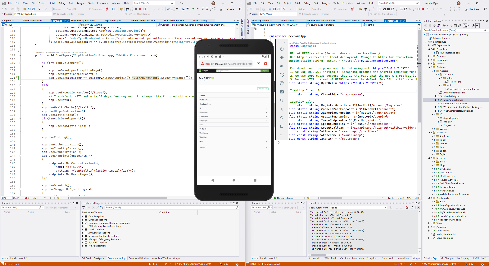

# Communicating Between a Local .NET Backend and a Local MAUI App Running on Android Emulator

When developing a MAUI mobile app that communicates with a .NET backend running locally, it's important to understand the different ways to connect the two. In this article, we'll explore the three main solutions to this problem. The good part is that every solution works. I started writting this article because I had to struggle a bit at the begining of my project to setup this, and I'd like to avoid wasting time for this in the future and if I can help others on the way than it's even better.



## Solution 1: Use a Self-Signed Certificate

One solution is to use a self-signed certificate for both the .NET backend and the Android Emulator. However, this solution can be time-consuming and slow down the development process, so it's not recommended. Especially, if you want to use different computers or with different colleagues, everyone will have to handle the certificate generation, storage in local computer and code that use the certificate when running in debug. Also, everytime you deploy a new emulator you will have to push the certificate inside and add it as a trusted certificate.

## Solution 2: Run Against the Backend in HTTP

Another solution is to run against the backend in HTTP. However, since Android 9.0 - API Level 28, you need to change some settings to allow clear HTTP traffic.

## Solution 3: Use HTTPS and Allow CORS Requests

The third and recommended solution is to use HTTPS and allow CORS (Cross-Origin Resource Sharing) requests in the .NET backend when running in debug mode or in dev settings. As the Android Emulator is a VM and "localhost" redirects to its own network, not the host network (i.e. your laptop). Therefore, the solution is to use "10.0.2.2:port" instead. This URL is the callback to the host network.

To ensure that the Android Emulator can communicate with the .NET backend correctly, you should also ensure that the backend service allows CORS requests from the emulator's IP address:

```
public void Configure(IApplicationBuilder app, IWebHostEnvironment env)
{
    if (env.IsDevelopment())
    {
        app.UseDeveloperExceptionPage();
        app.UseMigrationsEndPoint();
        app.UseCors(builder => builder.AllowAnyOrigin().AllowAnyMethod().AllowAnyHeader());
    }
    else
    {
        app.UseExceptionHandler("/Error");
        // The default HSTS value is 30 days. You may want to change this for production scenarios, see <https://aka.ms/aspnetcore-hsts>.
        app.UseHsts();
    }
		// Other configuration code ...
}

```

By following these guidelines, you can ensure that your MAUI app and .NET backend communicate correctly, making the development process smoother and more efficient.

## Summary

When developing a MAUI app that communicates with a .NET backend running locally, it's important to use the right approach. Using a self-signed certificate is not recommended, while running against the backend in HTTP can be problematic due to Android's security settings. The recommended approach is to use HTTPS and allow CORS requests in the .NET backend, ensuring that the Android Emulator can communicate with the backend correctly.


## Bonus Solution: Use ngrok

Another solution to consider for communicating between a local .NET backend and a local MAUI app running on an Android emulator is to use **ngrok**. By using ngrok, you are making your local backend server available to the whole internet. Even though the backend is running locally, you can get a real ip address and domain name. This can help in bypassing some of the limitations of the Android Emulator and simulating a more production-like environment during development.

**How it works?** Ngrok creates a secure public URL (e.g., **[https://yourapp.ngrok.io](https://yourapp.ngrok.io/)**) to your localhost backend server.

**Disclaimer:** Ngrok can be a powerful tool for local development, but it should replace a proper staging or production environments. _Always follow best practices when it comes to deploying and hosting your applications for production._